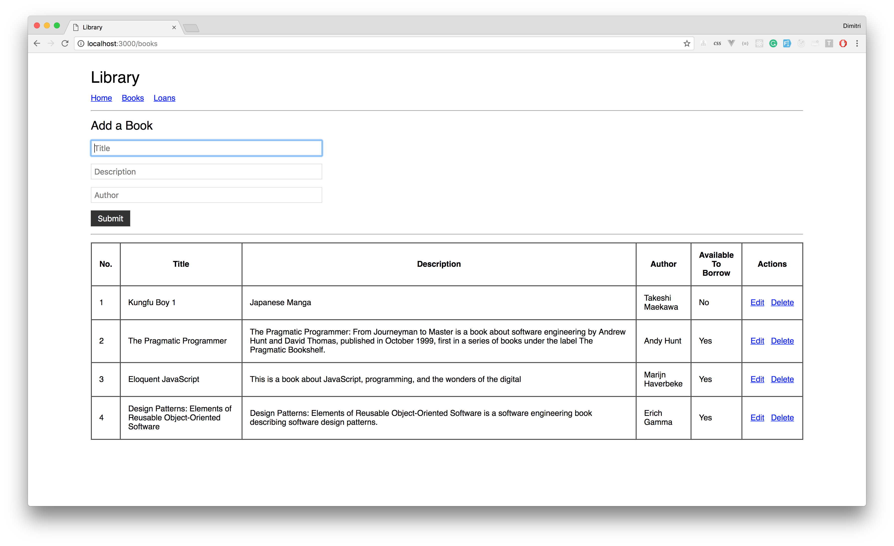
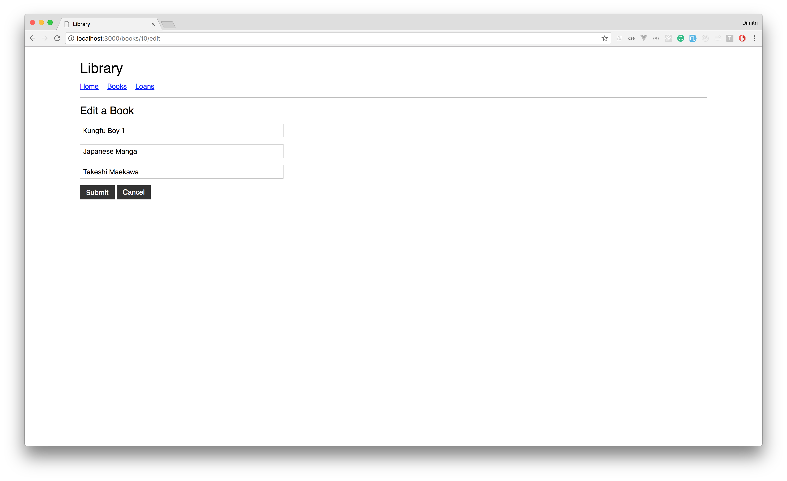
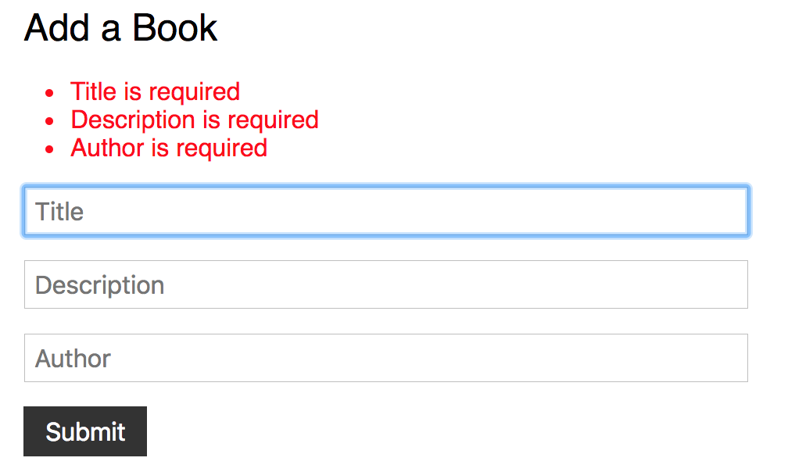
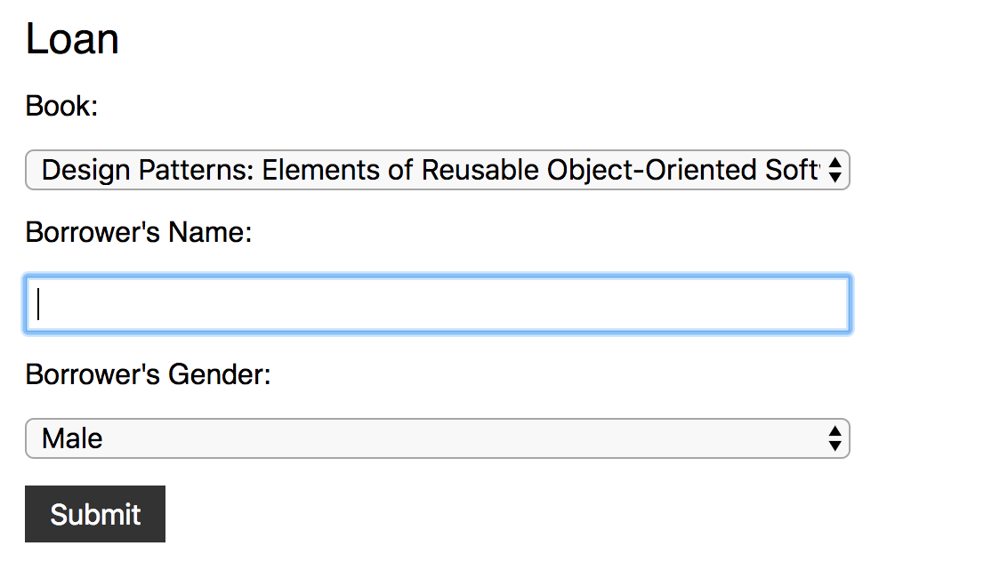
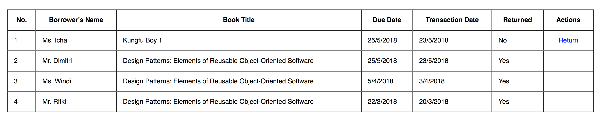
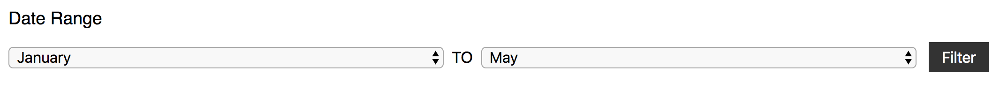

# Library Application

Challenge kali ini adalah membuat aplikasi perpustakaan sederhana menggunakan **Express** and **Sequelize**.
Baca tiap *specification* dengan baik, ikuti apa yang diminta.

## Spec 0
Install dependencies seperti: `express`, `sequelize`, dll. Inisialisasi project kalian menggunakan
command yang disediakan oleh `sequelize`. Isi konfigurasi database, database *HARUS* diberi nama
**super_live_code_week_4**

## Spec 1
Buat semua *migration* yang diperlukan oleh aplikasi ini:
- Books
  - `title (string)`
  - `description (string)`
  - `author (string)`
  - `availableToBorrow (boolean)`
- Loans
  - `borrowerName (string)`
  - `borrowerGender (string)`
  - `dueDate (date)`
  - `returned (boolean)`

Relasi antar kedua *table* adalah 1 `Book` memiliki banyak `Loan`. Kamu boleh menambahkan kolom baru untuk memenuhi relasi tersebut, selain itu **HARUS** mengikuti *requirement* di atas.

## Spec 2
Buat 2 *migration* baru. Satu untuk mengubah *default value* kolom `availableToBorrow` menjadi `true`. Satu lagi untuk mengubah *default value* `returned` menjadi `false`

## Spec 3
Buat *seed* untuk mengisi `Books`. (3 record)

## Spec 4
Buat fitur **CRUD** untuk *Books*. Format routing **HARUS SAMA PERSIS** dengan ketentuan sebagai berikut:

| Method | Route             | Description    |
|--------|-------------------|----------------|
| GET    | `/books`            | Menampilkan data `Books` |
| POST   | `/books`            | Create `Book` baru |
| GET    | `/books/:id/edit`   | Menampilkan form edit `Book` dengan isi nilai `Book` yang akan di-edit |
| POST   | `/books/:id/update` | Update data `Book` berdasarkan `id` |
| GET    | `/books/:id/delete` | Delete data `Book` berdasarkan `id` |

NOTE: Untuk route `GET /books`, tampilkan `Books` yang telah diurutkan berdasarkan tanggal data tersebut dibuat. (Dari yang paling baru ke yang paling lama)

## Spec 5
Buat halaman untuk menampilkan `Books` dan *form* untuk menambahkan `Book`, contoh:

## Spec 6
Buat halaman untuk edit `Book` dimana semua data nya terpopulate sebagai default value di masing-masing input type nya (apabila select option, akan ter-selected). contoh:

## Spec 7
Buat validation di form *add* dan *edit* `Book` yang mengharuskan user mengisi semua input field. Tampilkan `validation error` di atas form jika ada. Salah satu contoh:

## Spec 8
Buat fitur **Loan** untuk meminjam *Books*. Format routing **HARUS SAMA PERSIS** dengan ketentuan sebagai berikut:

| Method | Route             | Description    |
|--------|-------------------|----------------|
| GET    | `/loans`            | Menampilkan data `Loans` |
| POST   | `/loans`            | Create `Loan` baru |
| GET    | `/loans/:id/return`   | Mengembalikan buku (ganti status `Book` yang dikembalikan menjadi *available*) |

NOTE: Untuk pembuatan `Loan` baru, field `dueDate` akan otomatis diisi dengan tanggal saat dimasukkan + 2 hari (ex: Tanggal input adalah 25 Mei, maka `dueDate` akan menjadi 27 Mei).

## Spec 9
Buat validation di form *add* `Loan`. Tampilkan `validation error` di atas form jika ada. Contoh seperti di `Spec 7`. *Required fields*: `bookId`, `borrowerName`, `borrowerGender`

## Spec 10
Buat halaman/form dan routes untuk untuk menambahkan data pinjaman (`Loan`) contoh:

NOTE: Data `Books` yang ditampilkan di dalam pilihan **HARUS** buku yang *available* untuk dipinjam dan diurutkan sesuai abjad (A-Z).

## Spec 11
Buat fungsi pada model untuk mengganti status ketersediaan buku menjadi `false` ketika `Loan` dibuat dan fungsi untuk mengubah menjadi `true` saat buku dikembalikan. (Dilarang mengganti secara langsung dari `Controller/Routes`!)

## Spec 12
Buat fungsi untuk mengubah format tanggal yang kita ambil dari database menjadi `'TANGGAL/BULAN/TAHUN'` (ex: `'19-11-2018'`) tanpa merubah model & controller/routes !

## Spec 13
Buat sebuah method untuk menampilkan *title* dari nama peminjam buku (`borrowerName`) berdasarkan `borrowerGender`. Jika `'Male'` maka tambahkan *title* `'Mr.'` dan jika `'Female'` maka tambahkan `'Ms.'` pada model tanpa merubah struktur table !

## Spec 14
Buat halaman untuk menampilkan `Loans`, urutkan data berdasarkan tanggal data tersebut dibuat (Dari yang paling baru ke yang paling lama). Contoh:

NOTE:
- Untuk menampilkan `'Mr.'`/`'Ms.'` harus sesuai dengan `Spec 13`
- Untuk menampilkan tanggal yang sudah di-format harus sesuai dengan `Spec 12`

## Spec 15
Buat fitur untuk menampilkan data `Loans` berdasarkan filter dimana terdapat dropdown
yang berisi pilihan untuk filter.

1. *range* bulan dari transaction date yang diberikan. Contoh form:

NOTE: Untuk fitur ini, tentu saja kalian membutuhkan **tahun** juga untuk melakukan *query* ke database (ex: `'January 2018'` -> `'March 2018'`). Tahun akan diambil dari tahun sekarang (tahun aplikasi ini saat sedang dibuka, jadi ketika aplikasi dibuka pada tahun 2020 maka akan melakukan filter untuk tahun 2020).

2. filter by *borrower's name*
    ketika memilih ini pada dropdown maka akan muncul input text. Input text bisa diisi
    dengan string dan ketika menekan tombol search akan mencari `borrower's name` yang menyerupai input parameter

(untuk filter no 2 memang tidak ada di contoh demo nya)

## Demo Aplikasi

